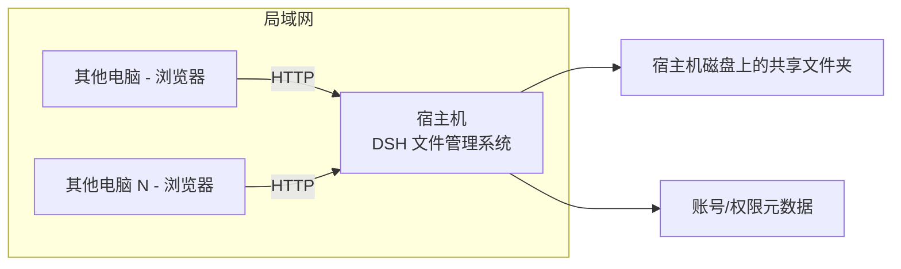

# 私域枢纽（PrivHub）文件管理系统 — 需求记录

> 本文档是与用户沟通后沉淀的**需求基准**，作为后续所有开发、沟通、增量改动的依据。
> 每次新增功能或调整构思，先更新本文档的相关章节。

---

## 1. 项目定位

- **名称**：**私域枢纽（PrivHub）** — 公司专用文件管理系统
- **目标**：局域网内所有终端电脑，通过网页浏览器访问宿主机上的共享文件夹，实现文件的浏览、上传、下载与管理。
- **形态**：完全基于 **DeepSeek Harness（DSH）** 底层架构，以「插件」为基本单位搭建。**不做独立网站**。

---

## 2. 架构模型

- **拓扑**：中心化。一台「宿主机」当服务器，局域网内其他电脑通过浏览器访问它。
  - 宿主机 = 公司那台 Windows 电脑（配置较低，**只当服务器跑，不做开发**）。
  - 开发机 = 当前这台电脑（开发、调试完成后，再部署到宿主机）。
- **访问方式**：浏览器访问宿主机的页面（HTTP）。



---

## 3. 关键技术决策

| 决策项 | 结论 |
|--------|------|
| 服务器形态 | 单台中心服务器（中心化） |
| 宿主机操作系统 | **Windows 原生**（不装 Linux/WSL，便于后期不懂 Linux 的同事维护） |
| 文件存储位置 | **宿主机磁盘上的真实文件夹**，浏览器直接读写它 |
| 应用形态 | 融入 DSH，作为它的插件/面板，不独立成站 |
| UI 风格 | **极简**，功能优先 |
| 开发背景 | 用户会一点网页制作，能看懂模块、分得清插件，但不擅长整体大项目 |

---

## 4. 基础架构：一切皆插件

- 以 **DSH 底层架构** 作为地基。
- 后端功能按域拆分为可热插拔、可装卸的插件（✅ 2026-08-27 插件化重构落地）：
  - `privhub-core`（共享存储/权限服务）+ `privhub-auth` / `privhub-files` / `privhub-trash` / `privhub-admin` 四业务插件，共 22 接口。
  - 今后新功能 = 新插件（或归入对应域插件）；单个插件可独立停用/替换/回滚（契合插件工程规范的 A-1 备份机制）。
  - 前端为宿主替换形态（单 Vue 页接管底座 dist）：底座 UI 是 React/slot 制式与 Vue 路线不兼容，此取舍见《架构与插件设计》状态说明。

### 4.1 两层「插件」的区分（重要）

| 类型 | 说明 | 例子 |
|------|------|------|
| 🟢 直接复用 | DSH 生态里现成的通用能力，可直接借鉴/复用 | 拖拽文件进框、看板、通知、UI 组件 |
| 🟡 自研业务插件 | 文件系统核心逻辑，需按插件规范自研 | 账户/权限、树形浏览、上传下载、右键菜单、后台审批 |

> 核心结论：**插件化的「壳子」能复用，但文件系统的核心逻辑（读写磁盘、权限判断、上传下载）需自研** —— 好在按插件化拆成小块后，后期好维护、好增量改。

### 4.2 前端布局（骨架）

- 底层是三/四重布局骨架，**每个区域都是插件**：
  - 顶栏（Top Bar）
  - 左侧树形栏（Tree Sidebar）
  - 右侧可伸缩功能条（Collapsible Panel）
  - 中间文件显示/文件夹面板（File Panel）
- **左侧树形文件管理插件**：左键点击展开文件夹显示内容；长按/右键弹菜单，做复制/移动/删除等操作。

---

## 5. 功能清单

### 5.1 账户 / 权限系统（自研插件）

- 负责判断「进来的是管理员还是普通用户」。
- **账号流程（现状）**：
  1. 用户浏览器连上系统 → 弹出登录对话框。
  2. 有账号 → 直接登录；无账号 → 可注册，注册后**直接建为普通用户**（默认仅「公共」项目权限）。
  3. 管理员登录后在「用户管理」中调整用户的角色与项目权限（含重置密码）。
- 登录后根据账号自动显示对应权限。

> 早期设想的「注册 → 管理员审批」流程已简化：注册即生效，无需审批。如需审批后台，列入阶段三后话。

### 5.2 文件操作（自研插件）

- 浏览目录 / 树形导航
- 新建文件夹
- 上传文件（✅ 2026-08-27 已实现：「＋添加文件」按钮批量上传，单文件 ≤2GB，同名覆盖；**拖拽上传**仍待做）
- 下载文件
- 复制 / 移动 / 删除（右键菜单）
- 多人管理

### 5.3 复用 DSH 现成能力

- 拖文件进框即读取/关联 → 用于「拖拽上传」场景。

---

## 6. 部署方式

### 6.1 独立底座（✅ 已确认）

- 私域枢纽与 DeepSeek Harness 是**完全独立的两套程序**（比喻：同一引擎的「红警2」与「红警3」）。
- 做法：把 DSH 底座源码**复制一份**到独立项目目录（`F:\program\dsh-SQL\privhub\`），走单独流程，不引用、不共用。
- 底座本身是 pnpm monorepo，复制时**排除 `.git` 与 `node_modules`**，到新目录后 `pnpm install` + `pnpm build` 重建为可独立运行的底座。
- 与 DSH 的关系仅「底层架构同源」，运行、端口、插件树、数据完全隔离。

### 6.2 端口约定（✅ 已确定）

| 场景 | 端口 |
|------|------|
| 本机现有 DSH | 3080（已占用，不用）|
| 私域枢纽·开发环境 | **3180** |
| 私域枢纽·生产环境（宿主机） | **3181** |

### 6.3 交付流程

- 在**开发机**（`F:\program\dsh-SQL\privhub\`）中开发调试好。
- 通过 **向日葵 / 网盘等文件传输功能**，把整个项目目录传到宿主机对应位置。
- 宿主机**启动即用**（独立跑在 3181 端口）。
- 文件本体存储在宿主机（公司侧）磁盘上的 `shared/` 共享目录。

---

## 7. 分阶段计划

### 阶段一（✅ 已完成）

1. 底座（开源引擎副本）搭好并独立运行。
2. 登录系统做好。
3. 预置两个测试账号：
   - **管理员账号**：admin / admin123
   - **普通用户账号**：user1 / user123
4. 局域网访问打通：bind `0.0.0.0`，验证 `http://192.168.18.26:3180` 可访问，能登录进主界面 → 阶段一成功。

> 详见 `技术实施方案.md` 的「阶段一已完成」章节。

### 阶段二（✅ 已完成核心，增量进行中）

**已完成：**
- 登录 / 注册（合入 auth 插件）
- 项目权限隔离（普通用户只见有权限的项目，访问无权限返回 403）
- 项目级文件浏览（多级目录树展开/折叠/懒加载 + 面包屑导航）
- 新建文件夹 / 重命名 / 删除 / 详情
- **双击文件夹打开**（像 Windows 资源管理器）
- **排序（名称/大小/时间）+ 视图切换（网格/列表）**
- 主题切换（深色/浅色护眼）
- 用户管理（管理员：增删改查用户 + 分配项目权限 + 改角色 + **重置密码**）
- 管理员新建/删除项目（✅ 2026-08-27 起删除为软删除，整项目进回收站可恢复）
- 文件预览（图片/文本/PDF）
- 批量文件上传（＋添加文件按钮，浏览器多选 + HTTP 上传，2026-08-27）

**进行中 / 待做（用户已确认，逐个加）：**
- [x] 回收站（软删除 → 30天物理清除 → 可恢复）— ✅ 前后端全部完成（2026-08-27：左侧栏入口 + 列表/恢复/彻底删除/管理员清空过期；**项目与文件夹删除均进回收站**）
- [ ] 批量操作（多选 + 批量移动/删除/下载）
- [ ] 文件名搜索（内容搜索后面加）
- [ ] 审计日志（JSONL + 导出 CSV，保存 60 天）
- [ ] 拖拽上传（拖到当前文件夹自动上传；按钮批量上传 ✅ 已实现 2026-08-27）
- [ ] 全格式预览（除音视频）

### 阶段三及以后（持续扩展）

- 在线编辑 + 版本历史（方案讨论中，参考 Office/WPS 版本管理思路）
- 内容全文搜索、细粒度权限、分享链接
- 后续功能全部通过「**写新插件**」的方式增量添加。
- **智能体外部对接 API**（2026-08-28 新设想）：参考 llm-wiki「双形态」——人用桌面界面 + 智能体用 API。PrivHub 未来提供外部 API，让 AI 智能体（Claude Code/Codex 等）经鉴权后进入系统读取/操作数据；列入阶段三后话，届时设计鉴权与权限模型。

### 知识库演进方向（✅ 2026-08-27 新确认）

- **决策**：不另部署独立知识库产品，在 PrivHub 上扩展知识库能力，复用现有账号/项目权限体系。
- **AI 问答**：暂不需要，后续开发（RAG 方向，届时再评估硬件/接口）。
- 详见下文「7E. 知识库演进方向」。

---

## 7C. 目录结构（2026-08 整理后）

```
privhub/
├── privhub-app/     ← 私域枢纽应用：后端插件 + Vue 前端 + 数据
├── data-files/      ← 文件存储根（项目文件夹）
├── engine/          ← 开源引擎底座（复制的 DSH 源码，参照原结构整体移入）
├── home/            ← profile 配置（独立 DSH_HOME）
├── start.bat        ← 启动脚本（在 engine/ 内执行）
└── 部署说明.md       ← 部署文档
```

> 说明：项目根只保留私域枢纽自己的内容；底座整体在 `engine/` 内，参照原 DSH 源码结构。

---

## 7B. 前端布局（✅ 已确认，2026-08-28 修订）

> 2025-06-13 用户确认：前端原型图（`前端原型图.html`）布局完全正确，作为开发蓝图。
> **2026-08-28 布局修订**（插件化重构设计确认）：参考桌面版 llm-wiki（nashsu）呈现形式，改为「顶栏横排项目 + 项目内桌面式工作区」：

| 区域 | 内容 | 实现形态 | 状态 |
|------|------|----------|------|
| 顶栏 TopBar | **从左到右横排有权限的项目**（点击进入该项目）；右侧一组：➕ 圆形加号（hover 气泡「添加项目」，仅管理员）+ 当前用户 + 主题 + 退出 | privhub-shell 骨架插件（顶栏 slot） | 重构中 |
| 项目工作区（点击项目后） | 桌面版 wiki 式：功能图标栏（文件/搜索/回收站/设置…）+ 左侧目录树面板 + 中间文件面板 + 右侧预览条 | 各业务插件 client 挂载 | 重构中 |

> 旧布局（单 Vue 页四区：系统名/面包屑/当前用户/退出 + 项目树 + 文件面板 + 右侧条）为 2026-08-27 前形态，随插件化重构替换；早期「每个区域一个插件」的设想以《插件化重构设计.md》为现行基准。

---

## 7C. 分层权限模型（新增，待细化）

用户提出的权限分三层，对应三个维度：

1. **角色 Role**：管理员（admin）/ 普通用户（user）。「高层」角色为后续扩展项，当前未实现。
2. **范围 Scope**：能访问哪些「项目/目录」（A项目负责人只看 A，B 同理）。
3. **操作 Operation**：看 / 上传 / 下载 / 改 / 删（细粒度，含「只能上传不能下载」等）。

> 三者组合才是完整权限。细粒度到单文件的权限、「多人协作编辑」等标记为**后话**，阶段一不实现。

### ✅ 已确认：目录与项目关系 → 方案C
- **磁盘上按项目分文件夹**（/A项目、/B项目…），权限直接绑在项目文件夹上。
- 同时保留**权限表**，用于后续细化到子目录/单个文件级别的「看/传/下/改/删」权限。
- 阶段一先不实现细粒度，骨架搭起来后再看文件具体怎么呈现、怎么管理。

---

## 7D. 功能全景调研（网上收集，供补全）

参考：[丰盘 ECM/xpan](https://github.com/ekbcloud/xpan-docker)、[Kodcloud](http://docs.kodcloud.com/start/)、[内网文件共享方案](https://blog.saifanbox.com/%e5%86%85%e7%bd%91%e6%96%87%e4%bb%b6%e5%85%b1%e4%ba%ab%e7%b3%bb%e7%bb%9f%e6%80%8e%e4%b9%88%e6%90%ad%ef%bc%9f%e4%bc%81%e4%b8%9a%e6%9c%80%e5%b8%b8%e8%a7%81%e7%9a%84%e4%b8%89%e7%a7%8d%e6%96%b9%e6%a1%88/#main)

企业文件系统常见功能清单（标注优先级）：

- **基础（阶段一~二）**：浏览/树形导航、上传下载、新建文件夹、复制移动重命名删除、回收站。
- **进阶（阶段二~三）**：在线预览(图/PDF/Office/文本)、全文检索、链接分享、审计日志、空间统计、组织架构/部门分组。
- **后话（阶段三+）**：版本历史、多人协作编辑、评论标注、AD/LDAP 同步、数字水印、断点续传。

---

## 7E. 知识库演进方向（2026-08-27 确认）

> 定位：把 PrivHub 从「文件盘」演进为「文件盘 + 知识库」：不仅能存文件，还能**在线沉淀、编辑、检索结构化知识**。
> 不另起炉灶：复用现有登录/角色/项目权限/目录树，知识库长在项目文件夹里（与文件管理天然融合）。

### 9.1 能力清单（按优先级）

| 能力 | 说明 | 与已有待办的关系 |
|------|------|------------------|
| ① Markdown 在线编辑 | 在项目内新建/编辑 .md 文档（浏览器内编辑器） | 全新，知识库的入口（能写） |
| ② 全文搜索 | 文档内容检索，BM25 + CJK bigram 分词 | 升级原「文件名搜索」待办（能找到） |
| ③ 结构化组织 | 项目内文档目录/树（复用现有目录树与权限） | 复用现有能力 |
| ④ 版本历史 | 文档保存时留历史版本，可回看/恢复 | 阶段三待办提前至此方向 |
| ⑤ 知识关联 | 文档间引用/链接（wikilink 思路） | 后话 |
| ⑥ AI 问答 | RAG 问答 | 后话，依赖硬件/模型接口 |

### 9.2 参考资料（已拉入 `references/`）

| 参考 | 许可证 | 参考什么 | 不参考什么 |
|------|--------|----------|------------|
| `references/llm-wiki`（jackwener/llm-wiki） | Apache-2.0 | BM25+CJK bigram 全文搜索实现、Markdown 页面结构（frontmatter）、mtime+SHA256 增量同步思路 | 它是单机 CLI+agent skill 工具，非多用户系统，代码不直接搬用 |
| `references/llm_wiki`（nashsu/llm_wiki，16.8K⭐） | ⚠️ **GPL-3.0** | **功能参考**：三层架构（原始资料→Wiki页→Schema）、页面组织规范（frontmatter/wikilink/index.md/log.md/来源可追溯）、知识图谱可视化（sigma+graphology+Louvain 社区发现）、摄入队列持久化/崩溃恢复设计、三栏布局交互、Milkdown 编辑器体验 | ⚠️ GPL-3.0 强 copyleft：**只参考功能与设计，不拷贝源码**（拷入代码会使整个程序受 GPL 传染）；其摄入/生成深度依赖 LLM，与我们「暂不接 AI」路线不匹配，仅看非 AI 部分 |

> 调研结论（2026-08-27）：两个热门 llm-wiki 项目（jackwener 99⭐ / nashsu 16.8K⭐）均为个人向工具，不符合工业级标准（无多用户/权限/服务端）；
> 工业级开源知识库（Docmost/BookStack/Wiki.js 等）均需独立部署且与本机低配 Windows 宿主机约束冲突，故选择「在 PrivHub 上扩展」路线。
> RAG 类（MaxKB/Dify/RAGFlow）需 Docker+LLM，低配宿主机暂不可行，留作 ⑥ 后话评估。

---

## 8. 待确认 / 备忘

- [ ] 阶段一跑通后，确认局域网访问的 IP/端口配置方式。
- [x] 审批流已简化：注册直接生效（无审批），管理员事后在用户管理中调整权限；如需审批后台，列入阶段三后话。
- [ ] 拖拽上传的现成 DSH 插件筛选与复用评估。

---

*文档生成时间：会话首次需求确认阶段*
