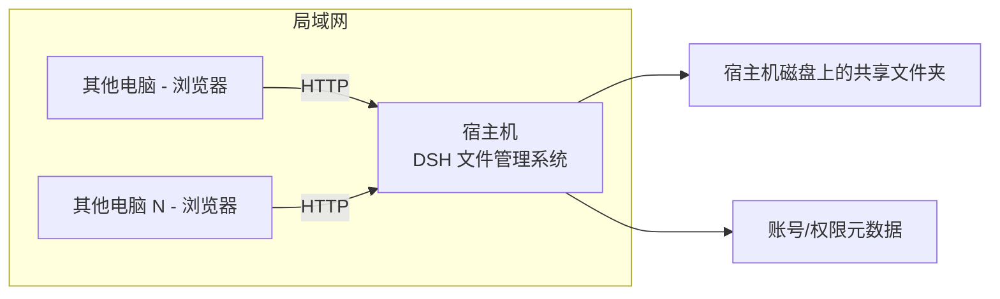

# 私域枢纽（PrivHub）文件管理系统 — 需求记录

> 本文档是与用户沟通后沉淀的**需求基准**，作为后续所有开发、沟通、增量改动的依据。
> 每次新增功能或调整构思，先更新本文档的相关章节。

---

## 1. 项目定位

- **名称**：**私域枢纽（PrivHub）** — 公司专用文件管理系统
- **目标**：局域网内所有终端电脑，通过网页浏览器访问宿主机上的共享文件夹，实现文件的浏览、上传、下载与管理。
- **形态**：完全基于 **DeepSeek Harness（DSH）** 底层架构，以「插件」为基本单位搭建。**不做独立网站**。

---

## 2. 架构模型

- **拓扑**：中心化。一台「宿主机」当服务器，局域网内其他电脑通过浏览器访问它。
  - 宿主机 = 公司那台 Windows 电脑（配置较低，**只当服务器跑，不做开发**）。
  - 开发机 = 当前这台电脑（开发、调试完成后，再部署到宿主机）。
- **访问方式**：浏览器访问宿主机的页面（HTTP）。

---

## 3. 关键技术决策

| 决策项 | 结论 |
|--------|------|
| 服务器形态 | 单台中心服务器（中心化） |
| 宿主机操作系统 | **Windows 原生**（不装 Linux/WSL，便于后期不懂 Linux 的同事维护） |
| 文件存储位置 | **宿主机磁盘上的真实文件夹**，浏览器直接读写它 |
| 应用形态 | 融入 DSH，作为它的插件/面板，不独立成站 |
| UI 风格 | **极简**，功能优先 |
| 开发背景 | 用户会一点网页制作，能看懂模块、分得清插件，但不擅长整体大项目 |

---

## 4. 基础架构：一切皆插件

- 以 **DSH 底层架构** 作为地基。
- 所有功能都是**可热插拔、可装卸的插件**。

### 4.1 两层「插件」的区分（重要）

| 类型 | 说明 | 例子 |
|------|------|------|
| 🟢 直接复用 | DSH 生态里现成的通用能力，可直接借鉴/复用 | 拖拽文件进框、看板、通知、UI 组件 |
| 🟡 自研业务插件 | 文件系统核心逻辑，需按插件规范自研 | 账户/权限、树形浏览、上传下载、右键菜单、后台审批 |

> 核心结论：**插件化的「壳子」能复用，但文件系统的核心逻辑（读写磁盘、权限判断、上传下载）需自研** —— 好在按插件化拆成小块后，后期好维护、好增量改。

### 4.2 前端布局（骨架）

- 底层是三/四重布局骨架，**每个区域都是插件**：
  - 顶栏（Top Bar）
  - 左侧树形栏（Tree Sidebar）
  - 右侧可伸缩功能条（Collapsible Panel）
  - 中间文件显示/文件夹面板（File Panel）
- **左侧树形文件管理插件**：左键点击展开文件夹显示内容；长按/右键弹菜单，做复制/移动/删除等操作。

---

## 5. 功能清单

### 5.1 账户 / 权限系统（自研插件）

- 负责判断「进来的是管理员还是普通用户」。
- **账号流程**：
  1. 用户浏览器连上系统 → 弹出登录对话框。
  2. 有账号 → 直接登录；无账号 → 可「申请」注册。
  3. 管理员在宿主机用**预置管理员账号**登录后台 → 审批申请通过，并分配相应权限。
- 登录后根据账号自动显示对应权限。

### 5.2 文件操作（自研插件）

- 浏览目录 / 树形导航
- 新建文件夹
- 上传文件（支持**拖拽到固定区域即上传**，复用 DSH 拖拽能力）
- 下载文件
- 复制 / 移动 / 删除（右键菜单）
- 多人管理

### 5.3 复用 DSH 现成能力

- 拖文件进框即读取/关联 → 用于「拖拽上传」场景。

---

## 6. 部署方式

### 6.1 独立底座（✅ 已确认）

- 私域枢纽与 DeepSeek Harness 是**完全独立的两套程序**（比喻：同一引擎的「红警2」与「红警3」）。
- 做法：把 DSH 底座源码**复制一份**到独立项目目录（`F:\program\dsh-SQL\privhub\`），走单独流程，不引用、不共用。
- 底座本身是 pnpm monorepo，复制时**排除 `.git` 与 `node_modules`**，到新目录后 `pnpm install` + `pnpm build` 重建为可独立运行的底座。
- 与 DSH 的关系仅「底层架构同源」，运行、端口、插件树、数据完全隔离。

### 6.2 端口约定（✅ 已确定）

| 场景 | 端口 |
|------|------|
| 本机现有 DSH | 3080（已占用，不用）|
| 私域枢纽·开发环境 | **3180** |
| 私域枢纽·生产环境（宿主机） | **3181** |

### 6.3 交付流程

- 在**开发机**（`F:\program\dsh-SQL\privhub\`）中开发调试好。
- 通过 **向日葵 / 网盘等文件传输功能**，把整个项目目录传到宿主机对应位置。
- 宿主机**启动即用**（独立跑在 3181 端口）。
- 文件本体存储在宿主机（公司侧）磁盘上的 `shared/` 共享目录。

---

## 7. 分阶段计划

### 阶段一（✅ 已完成）

1. 底座（开源引擎副本）搭好并独立运行。
2. 登录系统做好。
3. 预置两个测试账号：
   - **管理员账号**：admin / admin123
   - **普通用户账号**：user1 / user123
4. 局域网访问打通：bind `0.0.0.0`，验证 `http://192.168.18.26:3180` 可访问，能登录进主界面 → 阶段一成功。

> 详见 `技术实施方案.md` 的「阶段一已完成」章节。

### 阶段二（下一步）：文件核心操作

- 上传 / 下载 / 新建文件夹 / 复制 / 移动 / 重命名 / 删除
- 回收站
- 项目级权限隔离（A项目/B项目可见性）

### 阶段三及以后（持续扩展）

- 在线预览、细粒度权限、审计日志、版本历史
- 后续功能全部通过「**写新插件**」的方式增量添加。

---

## 7B. 前端布局（✅ 已确认）

> 2025-06-13 用户确认：前端原型图（`前端原型图.html`）布局完全正确，作为开发蓝图。

整体为「顶栏 + 三栏布局」的极简界面：

| 区域 | 内容 | 对应插件 | 阶段 |
|------|------|----------|------|
| 顶栏 TopBar | 系统名(私域枢纽)、面包屑导航、权限标识、当前用户头像、退出 | privhub-topbar / privhub-auth | 阶段一 |
| 左侧树形栏 | 目录树：左键展开、右键弹菜单；无权限的项目文件夹自动隐藏 | ds-file-tree | 阶段一 |
| 中间文件面板 | 当前目录文件/文件夹卡片 + 新建/上传/下载/移动/复制/删除按钮 + 拖拽上传区 | ds-file-panel / ds-file-ops / ds-file-upload | 阶段一~二 |
| 右侧可伸缩功能条 | 选中项详情、细粒度权限、版本历史（后话） | ds-inspector | 阶段一空壳，后续填充 |

---

## 7C. 分层权限模型（新增，待细化）

用户提出的权限分三层，对应三个维度：

1. **角色 Role**：管理员 / 高层 / 普通用户。
2. **范围 Scope**：能访问哪些「项目/目录」（A项目负责人只看 A，B 同理）。
3. **操作 Operation**：看 / 上传 / 下载 / 改 / 删（细粒度，含「只能上传不能下载」等）。

> 三者组合才是完整权限。细粒度到单文件的权限、「多人协作编辑」等标记为**后话**，阶段一不实现。

### ✅ 已确认：目录与项目关系 → 方案C
- **磁盘上按项目分文件夹**（/A项目、/B项目…），权限直接绑在项目文件夹上。
- 同时保留**权限表**，用于后续细化到子目录/单个文件级别的「看/传/下/改/删」权限。
- 阶段一先不实现细粒度，骨架搭起来后再看文件具体怎么呈现、怎么管理。

---

## 7D. 功能全景调研（网上收集，供补全）

参考：[丰盘 ECM/xpan](https://github.com/ekbcloud/xpan-docker)、[Kodcloud](http://docs.kodcloud.com/start/)、[内网文件共享方案](https://blog.saifanbox.com/%e5%86%85%e7%bd%91%e6%96%87%e4%bb%b6%e5%85%b1%e4%ba%ab%e7%b3%bb%e7%bb%9f%e6%80%8e%e4%b9%88%e6%90%ad%ef%bc%9f%e4%bc%81%e4%b8%9a%e6%9c%80%e5%b8%b8%e8%a7%81%e7%9a%84%e4%b8%89%e7%a7%8d%e6%96%b9%e6%a1%88/#main)

企业文件系统常见功能清单（标注优先级）：

- **基础（阶段一~二）**：浏览/树形导航、上传下载、新建文件夹、复制移动重命名删除、回收站。
- **进阶（阶段二~三）**：在线预览(图/PDF/Office/文本)、全文检索、链接分享、审计日志、空间统计、组织架构/部门分组。
- **后话（阶段三+）**：版本历史、多人协作编辑、评论标注、AD/LDAP 同步、数字水印、断点续传。

---

## 8. 待确认 / 备忘

- [ ] 阶段一跑通后，确认局域网访问的 IP/端口配置方式。
- [ ] 审批流细节（管理员后台界面设计）——后续阶段细化。
- [ ] 拖拽上传的现成 DSH 插件筛选与复用评估。

---

*文档生成时间：会话首次需求确认阶段*
